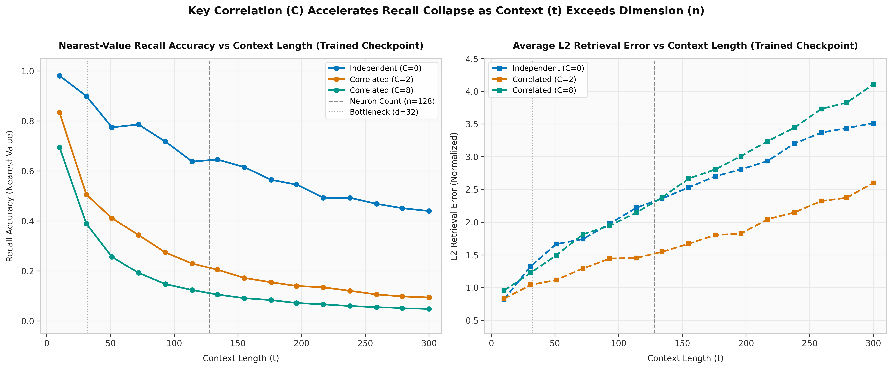

<p align="center">
  
</p>

# Synaptic Plasticity & In-Context Recall Collapse
### An Interactive Educational Explainer Bridging Biological Hebbian Memory with Transformers

**Team feedattention**  
*Pranavi Gottumukkala & Suday Nandan Reddy Samala*  
*Indian Institute of Technology, Kharagpur*

[](https://github.com/Pranaviee/feedattention)
[](https://dataforgeweb.sudaynandan95.workers.dev)
[](https://pytorch.org/)
[](https://react.dev/)
[](https://doi.org/10.48550/arXiv.2509.26507)

---

## Official Submission Links

* **Public GitHub Repository**: **[https://github.com/Pranaviee/feedattention](https://github.com/Pranaviee/feedattention)**  
  *(Canonical public codebase containing all model training code, mathematical verification, precomputed datasets, and web application source).*
* **Primary Live Interactive Tool**: **[https://dataforgeweb.sudaynandan95.workers.dev](https://dataforgeweb.sudaynandan95.workers.dev)**  
  *(Single public URL serving the complete interactive learning platform with live model inference and token-by-token checkpoint inspection).*

---

## Educational Track Overview

### Pedagogical Motivation
While modern deep learning curricula focus primarily on softmax attention and autoregressive KV caching, biologically grounded alternatives like **Baby Dragon Hatchling (BDH)** (Kosowski et al., 2025) introduce unnormalized associative plasticity that diverges significantly from standard sequence models.

This project was developed as an **interactive educational platform** to provide a rigorous, visual bridge between the theoretical mathematics and physical network mechanics.

### Target Audience & Learning Objectives
* **Audience**: Students, researchers, and practitioners in machine learning and computational neuroscience.
* **Core Objectives**: Provide direct visual and numerical inspection of the underlying synaptic dynamics: how Hebbian plasticity substitutes for dynamic KV caching, how sparse monosemantic activations constrain synaptic updates, and how additive superposition noise induces **In-Context Recall Collapse**.

### The Guided 4-Beat Learning Flow
The educational web application guides learners through four structured stages:
1. **Beat 1: The Short-Term Memory Bottleneck**: Visualizes why traditional Transformer KV caches scale linearly ($O(t)$ memory, $O(t^2)$ attention complexity) and establishes the core question: *Can a neural network store unbounded context in a fixed-size memory that never grows?*
2. **Beat 2: Biological Synaptic Plasticity**: Demonstrates Donald Hebb's 80-year-old principle (*"Neurons that fire together, wire together"*). Users see an unnormalized $n \times d$ synaptic matrix update step-by-step via outer products ($W_t = W_{t-1} + k_t v_t^\top$) with sparse ReLU activations.
3. **Beat 3: The Superposition Trade-off & Recall Collapse**: An interactive experimental sandbox driven by empirical and theoretical data. Learners use interactive sliders (context length, cue correlation, memory dimension) to observe additive superposition interference and evaluate where retrieval accuracy degrades.
4. **Beat 4: Live Checkpoint Inspector**: Connects the theoretical toy model to full-scale, real-world trained checkpoints (`bdh_d64.pt` and `bdh_d128.pt`). Learners enter custom prompts, step token-by-token through individual model layers, observe real-time sparsity percentages, and generate autoregressive completions directly from the running network.

### The Falsifiable Scientific Claim
> *A fixed-size synaptic memory can encode unbounded associations, but recall degrades with increasing load and deteriorates sharply when stored cues overlap.*

---

## Theoretical Foundations

### 1. Replaying KV-Cache as a Synaptic Weight Matrix

In standard Transformers, self-attention allows tokens to attend to all preceding tokens *including themselves* ($\tau \le t$). 

In BDH, causal attention enforces strict physical causality with a zero-diagonal mask ($\text{tril}(Q K^\top, -1)$): **the current token queries prior synaptic memory ($\tau < t$) before writing its own association, so a token never attends to itself**.

Tying queries and keys directly to the sparse positive neuronal activation vector $Q_t = K_t = x_t \in \mathbb{R}_{\ge 0}^{1 \times n}$ with projected values $V_t = v_t \in \mathbb{R}^{1 \times d}$, token retrieval is governed strictly over prior tokens:

$$Y_t = \sum_{\tau < t} (Q_t K_\tau^\top) V_\tau$$

In the sequential Hebbian loop, associations from prior timesteps accumulate into the synaptic weight matrix $\sigma_t \in \mathbb{R}^{n \times d}$ via outer-product updates modulated by a retention decay $\lambda \in (0, 1]$:

$$\sigma_t = \lambda \sigma_{t-1} + x_{t-1}^\top v_{t-1} = \sum_{\tau < t} \lambda^{t-1-\tau} x_\tau^\top v_\tau$$

When current activation $x_t$ arrives, retrieval occurs by driving the signal forward through these accumulated prior synaptic weights:

$$y_t = x_t \sigma_t = x_t \left( \sum_{\tau < t} \lambda^{t-1-\tau} x_\tau^\top v_\tau \right) = \sum_{\tau < t} \lambda^{t-1-\tau} (x_t x_\tau^\top) v_\tau = \sum_{\tau < t} \lambda^{t-1-\tau} (Q_t K_\tau^\top) V_\tau$$

By the associativity of matrix multiplication, $x_t (x_\tau^\top v_\tau) = (x_t x_\tau^\top) v_\tau$. Propagating an activation through the dynamic synaptic matrix is strictly isomorphic to causal linear attention ($\lambda = 1$ recovering $Y_t$ exactly). In [`tests/verify_hebbian_equivalence.py`](tests/verify_hebbian_equivalence.py), we verify that this difference is bounded by machine floating-point precision:

$$\max |Y_{\text{parallel}} - Y_{\text{Hebbian}}| < 10^{-15}$$

---

### 2. The Superposition Trade-off and Recall Collapse

In the theoretical framework of the BDH paper (**Claim 8, Appendix C.2**), memory retrieval is analyzed as an associative reconstruction problem:
* Let $a_q \in \mathbb{R}^d$ denote the **ground-truth target value vector** stored at historical timestep $q < t$.
* Let $a^*_q \in \mathbb{R}^d$ denote the **empirical reconstructed readout vector** retrieved by probing the accumulated synaptic memory $\rho_t = \sum_{j < t} K_j^\top V_j$ with key $K_q$. The asterisk ($*$) is the standard estimation notation denoting the retrieved estimate of the target vector $a_q$.

Normalizing by the self-gain $\|K_q\|^2 = K_q K_q^\top$, the retrieved vector $a^*_q$ decomposes into the target signal and additive superposition interference:

$$a^*_q = \frac{K_q \rho_t}{\|K_q\|^2} = \underbrace{a_q}_{\text{Target Signal}} + \underbrace{\sum_{\substack{j < t \\ j \neq q}} \frac{K_q K_j^\top}{\|K_q\|^2} a_j}_{\text{Superposition Interference}}$$

#### Theoretical Lower Bound (Claim 8, Appendix C.2)
Kosowski et al. formally prove that for latent neuron dimension $n$, context length $t$, and pairwise key correlation coefficient $C$, the $L_2$ reconstruction error between the retrieved readout $a^*_q$ and the ground-truth target $a_q$ satisfies:

$$\|a^*_q - a_q\|_2 = O(\sqrt{\delta}), \quad \text{where } \delta > \frac{t \cdot (C + 1) \log n}{n}$$

* **Independent Cues ($C = 0$)**: When keys are near-orthogonal, the cross-product expectation satisfies $\mathbb{E}[K_q K_j^\top] = 0$. The interference variance scales slowly as $O(t / n)$, maintaining low $L_2$ error and preserving nearest-neighbor recall accuracy over moderate sequence lengths.
* **Correlated Cues ($C > 0$)**: When stored cues share semantic overlap or correlation, $\mathbb{E}[K_q K_j^\top] > 0$ introduces systematic positive drift. Interference compounds constructively across timesteps, causing the retrieved vector $a^*_q$ to rapidly diverge from target $a_q$ and precipitating **In-Context Recall Collapse** well before sequence length $t$ reaches latent dimension $n$.

<p align="center">
  
</p>

*Empirical recall collapse measured on checkpoint `bdh_d128.pt` across context lengths $t \in [10, 300]$ and key correlation values $C \in [0.0, 0.9]$.*

---

### 3. Computational Cost: Transformer vs. Recurrent BDH

| Context Regime | Transformer Attention | Recurrent BDH | Lower Complexity |
| :--- | :---: | :---: | :---: |
| $T \gg n$ | $O(T^2 d)$ | $O(T n d)$ | **BDH (Linear in context length $T$)** |
| $T \ll n$ | $O(T^2 d)$ | $O(T n d)$ | **Transformer** |
| $T = n$ | $O(n^2 d)$ | $O(n^2 d)$ | Same leading-order cost |

*Per-layer sequence-mixing costs; recurrent BDH evaluation assumed during inference.*

---

## Localhost Reproduction Guide

You can reproduce both the interactive educational web application and the underlying machine learning experiments locally.

### Prerequisites
* Python 3.9+ (Python 3.10+ recommended)
* Node.js 18+ and npm

```bash
git clone https://github.com/Pranaviee/feedattention.git
cd feedattention
```

---

### Track A: Run the Educational Web Tool Locally

The local development server launches the complete educational platform with live checkpoint evaluation:

```bash
cd web
npm install
npm run dev
```

* The React educational explainer runs at `http://localhost:5173`.
* Vite starts the local Python inference server (`web/livemodel/server.py`) in the background on port `8765`.
* API calls (`/api/trace`, `/api/generate`) are automatically proxied to the live model backend.

---

### Track B: Run & Verify Machine Learning Benchmarks

Install Python dependencies:

```bash
pip install -r requirements.txt
```

#### 1. Mathematical Equivalence Proof
Verify that parallel attention matches the sequential Hebbian loop to machine precision:
```bash
python3 tests/verify_hebbian_equivalence.py
```

#### 2. Model Training on TinyShakespeare
Train BDH configurations from scratch:
```bash
# Train d=64 model (4 layers, 4 heads, N=1024)
python3 train_bdh_tinyshakespeare.py --d 64 --iters 800

# Train d=128 model (4 layers, 4 heads, N=2048)
python3 train_bdh_tinyshakespeare.py --d 128 --iters 800
```

#### 3. Checkpoint Recall Collapse Benchmark
Measure retrieval degradation across context lengths and correlation factors:
```bash
python3 tests/eval_checkpoint_correlation_graph.py
```
Outputs and plots are written to [`results/`](results/).

#### 4. Command-Line Inference & State Inspection
```bash
# Text generation with temperature sampling
python3 inference.py --prompt "ROMEO: " --model bdh_d128.pt

# Layer-by-layer tensor inspection
python3 tests/inspect_bdh_step_by_step.py --prompt "paris" --checkpoint bdh_d64.pt
```

---

## Checkpoints & Model Configurations

Trained checkpoints are stored in the repository for immediate evaluation:

| Checkpoint | Embedding Dim ($d$) | Layers | Heads | Latent Dim ($n$) | Parameters | Checkpoint Size |
| :--- | :---: | :---: | :---: | :---: | :---: | :---: |
| [`bdh_d64.pt`](bdh_d64.pt) | 64 | 4 | 4 | 1,024 | ~820K | ~3.3 MB |
| [`bdh_d128.pt`](bdh_d128.pt) | 128 | 4 | 4 | 2,048 | ~3.2M | ~12.9 MB |

---

## Repository Structure

```text
├── README.md                              # Comprehensive project documentation
├── requirements.txt                       # Core Python dependencies
├── images/                                # Visual assets
│   └── synapse.jpg                        # Hero banner
├── train_bdh_tinyshakespeare.py           # BDH training pipeline
├── inference.py                           # CLI interactive text generation
├── input.txt                              # TinyShakespeare dataset (~1.1 MB)
├── bdh_d64.pt                             # Checkpoint for BDH d=64
├── bdh_d128.pt                            # Checkpoint for BDH d=128
│
├── results/                               # Empirical reports, CSVs, and figures
│   ├── checkpoint_correlation_recall_collapse.png
│   ├── key_correlation_recall_collapse.png
│   ├── checkpoint_recall_collapse_data.csv
│   └── checkpoint_recall_collapse_report.md
│
├── tests/                                 # Verification test suite
│   ├── verify_hebbian_equivalence.py      # Equivalence proof (< 1e-15 error)
│   ├── eval_checkpoint_correlation_graph.py
│   ├── inspect_bdh_step_by_step.py        # Layer-by-layer tensor inspector
│   ├── plot_correlation_collapse.py
│   └── sample_checkpoints.py
│
├── web/                                   # Educational Interactive Web Platform
│   ├── src/                               # Frontend source (Tailwind, Visx, KaTeX)
│   │   ├── pages/                         # Beats 1-3 narrative & Beat 4 Live Model
│   │   └── components/                    # Synaptic tables, QueryFlow, interactive charts
│   ├── livemodel/                         # Zero-dependency Python inference microservice
│   │   ├── server.py                      # ThreadingHTTPServer API
│   │   ├── bdh.py                         # Standalone BDH loader
│   │   ├── index.html & app.js            # Standalone inspector interface
│   │   └── bdh_d64.pt & bdh_d128.pt       # Checkpoint files for Docker deployment
│   ├── Dockerfile                         # Slim CPU-only PyTorch container
│   ├── render.yaml                        # Render Web Service Blueprint
│   ├── wrangler.toml                      # Cloudflare Workers configuration
│   ├── worker.js                          # Cloudflare edge reverse proxy
│   └── package.json                       # Frontend dependencies and scripts
│
└── bdh_ref/                               # Reference implementation (Pathway BDH)
```

---

## References & Citations

### Primary Relevant Research Papers

```bibtex
@article{kosowski2025dragon,
  title={The Dragon Hatchling: The Missing Link between the Transformer and Models of the Brain},
  author={Kosowski, Adrian and Uzna{\'n}ski, Przemys{\l}aw and Chorowski, Jan and Stamirowska, Zuzanna and Bartoszkiewicz, Micha{\l}},
  journal={arXiv preprint arXiv:2509.26507},
  year={2025},
  url={https://arxiv.org/abs/2509.26507}
}

@inproceedings{beck2024xlstm,
  title={xLSTM: Extended Long Short-Term Memory},
  author={Beck, Maximilian and P{\"o}ppel, Korbinian and Spanring, Markus and Auer, Andreas and Prudnikova, Oleksandra and Kopp, Michael and Klambauer, G{\"u}nter and Brandstetter, Johannes and Hochreiter, Sepp},
  booktitle={Advances in Neural Information Processing Systems (NeurIPS)},
  year={2024},
  url={https://arxiv.org/abs/2405.04517}
}

@article{mitropolsky2025simulated,
  title={Simulated Language Acquisition in a Biologically Realistic Model of the Brain},
  author={Mitropolsky, Daniel and Papadimitriou, Christos H.},
  journal={bioRxiv preprint},
  year={2025},
  doi={10.1101/2025.07.15.664996}
}
```

### Extended Bibliographic References

1. **A. Kosowski et al.** *The Dragon Hatchling: The Missing Link between the Transformer and Models of the Brain.* arXiv:2509.26507, 2025.
2. **Pathway.** *BDH (Dragon Hatchling): Official Code Repository.* [github.com/pathwaycom/bdh](https://github.com/pathwaycom/bdh).
3. **Amit Singh Bhatti.** *Neurosynaptic plasticity—The cell assembly theory.* Medium, 2021.
4. **A. Vaswani et al.** *Attention Is All You Need.* Advances in Neural Information Processing Systems (NeurIPS), arXiv:1706.03762, 2017.
5. **A. Gu and T. Dao.** *Mamba: Linear-Time Sequence Modeling with Selective State Spaces.* arXiv:2312.00752, 2023.
6. **M. Beck et al.** *xLSTM: Extended Long Short-Term Memory.* NeurIPS, arXiv:2405.04517, 2024.
7. **N. F. Liu et al.** *Lost in the Middle: How Language Models Use Long Contexts.* Transactions of the Association for Computational Linguistics, arXiv:2307.03172, 2023.
8. **D. Mitropolsky and C. H. Papadimitriou.** *Simulated Language Acquisition in a Biologically Realistic Model of the Brain.* bioRxiv preprint, doi:10.1101/2025.07.15.664996, 2025.
9. **B. Engdahl et al.** *BDH-CQ: In-Context Learning with Recurrent Latent Reasoning.* arXiv:2608.09888, 2026.

---

## AI & Asset Disclosures

### Generative AI Usage
* **Summary & Text Editing**: `prism.openai` was used for editorial refinement and structure drafting of the one-page research summary document.
* **Code Implementation & Pair Programming**: Google Antigravity and Claude Code were used for codebase consolidation, development assistance, and web component scaffolding.
* **Literature Exploration & Research**: Connected Papers and Google Gemini were utilized during the research phase for paper discovery, citation mapping, and theoretical cross-referencing.
* **Authenticity & Independent Verification**: All core model training logic, recurrent Hebbian loop implementations, mathematical equivalence proofs, and empirical recall collapse evaluations were implemented, executed, and verified empirically against the theoretical claims in the original research papers.

### Third-Party Assets & Frameworks
* **Machine Learning Stack**: PyTorch (`torch`), NumPy (`numpy`), Matplotlib (`matplotlib`).
* **Frontend Web Application**: React 18, Vite, TypeScript, TailwindCSS, KaTeX (mathematical typesetting), Visx & Recharts (data visualization), Motion & Anime.js (interactive animations).
* **Dataset**: TinyShakespeare dataset (public domain, Andrej Karpathy).
* **Reference Upstream**: Official Pathway BDH repository ([pathwaycom/bdh](https://github.com/pathwaycom/bdh)).
